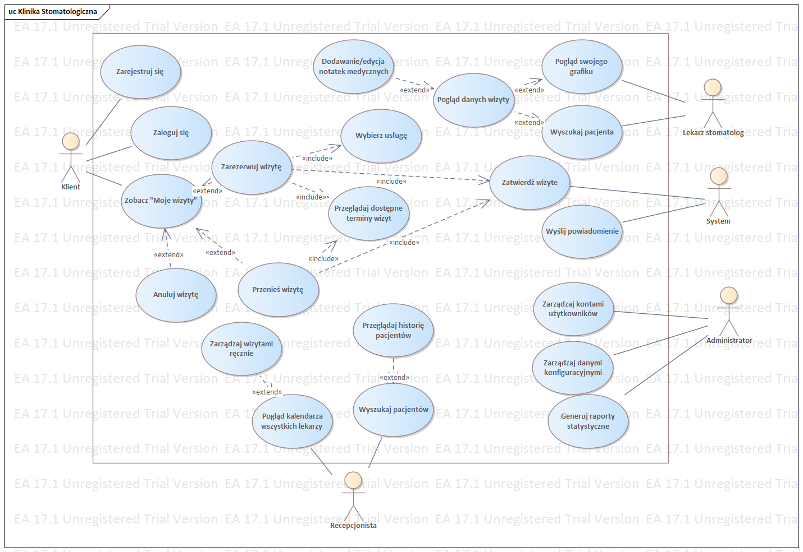

# Online Appointment Booking System – "Zdrowy Ząbek" Clinic

This project encompasses the Object-Oriented Analysis and Design (OOAD) and Software Requirements Specification (SRS) for a comprehensive appointment booking platform designed for a private dental clinic in Gdańsk. The system automates patient scheduling, replacing traditional paper calendars with a 24/7 web-based application to optimize medical staff availability.

## 1. Object-Oriented Analysis and Design (OOAD)
The modeling phase maps the system's structural and behavioral logic using standard UML conventions.

**Stage 1: Requirements Engineering & Use Case Modeling**
* Conducted problem analysis to address manual scheduling inefficiencies and high administrative costs.
* Identified key primary and secondary actors: Patient, Receptionist, Dentist, Assistant, Administrator, and Email/SMS gateways.
* Mapped core system services (registration, booking, cancellation) using a Use Case Diagram with defined *include* and *extend* relationships.
[Download Vision Document (PDF)](./stage_1/WizjaSystemu.pdf)

Stage 2: Static Modeling (Class Architecture)
This stage involved designing the system's "skeleton"—its structure and data relationships.
Class Identification: Identified domain entities such as Patient, Doctor, Visit, and Service. The model focuses exclusively on business logic rather than technical implementation details like databases or UI screens.
Attributes & Operations:
Defined specific attributes for each class (e.g., PESEL, contactDetails, VisitStatus).
Assigned operations to the classes they logically belong to (e.g., assignDoctor() within the Visit class).
Relationship Mapping:
Associations: Defined with explicit multiplicities and role names to ensure data integrity.

Stage 3: Dynamic Modeling (Behavioral Design)
The final phase modeled how objects interact over time and how they change states during system execution. A total of 6 diagrams were developed:

Sequence Diagrams (3):
Illustrated the chronological exchange of messages between actors, UI objects, and system lifelines.
Utilized Fragments (Alt, Opt, Loop) to model conditional logic and iterative processes.
Ensured deep-system interactions relied on synchronous message calls corresponding to the operations defined in the Class Diagram .

Communication Diagram (1):
Focused on the structural relationships and links between objects participating in a specific Use Case interaction .

Activity Diagram (1):
Modeled the high-level business process (e.g., the workflow from a patient's initial inquiry to the final payment) .

State Machine Diagram (1):
Defined the lifecycle of a complex object, such as a Visit.
Specified states (e.g., New, Confirmed, Cancelled, Completed) and transitions triggered by specific events, guarded by conditions, and resulting in defined effects .

## 2. Software Requirements Specification (SRS)
The complete functional and non-functional requirements are documented in **SRS_DentalClinic.pdf**. The system architecture is built on reliable, straightforward components to ensure high availability and data security. 

**Business and Functional Objectives**
* Provide a responsive, 24/7 online portal for patients to search available slots and independently manage appointments.
* Automate SMS and email notifications to request confirmations and remind patients of upcoming visits.
* Supply reception staff with a centralized internal panel to monitor schedules, manage manual overrides, and resolve scheduling conflicts.
* Offer dentists an isolated, responsive view of their daily and weekly schedules.

**System Architecture & Subsystems**
* **Patient Booking Subsystem:** A public-facing web frontend and backend API facilitating slot filtering, user authentication, and appointment creation.
* **Administration Subsystem:** An internal module for clinic staff to manage overall workflow, block out doctor unavailability, and configure system rules.
* **Integration Subsystem:** A dedicated background service handling external SMS gateway communications and bidirectional calendar synchronization with the clinic's local Dental PMS.

**Technical Stack & Quality Requirements**
* **Database:** Relational storage utilizing PostgreSQL or MySQL, featuring automated daily backups.
* **Frontend:** Built with HTML, CSS, and JavaScript, strictly compliant with WCAG 2.1 accessibility standards.
* **Infrastructure:** Hosted on a cloud server utilizing Docker containerization for stable deployment and environment isolation.
* **Security & Performance:** Requires HTTPS/SSL data encryption, GDPR-compliant data handling, CAPTCHA bot protection, and a system response time of under 2 seconds under standard load.

## 3. Final System Model
The finalized architectural structure, including all diagrams, is compiled into an Enterprise Architect project file. Please note that **Enterprise Architect** is required to view the `.qea` file.
* **Latest Version:** [stage_3/PU_and_DiagramKlasV2.qea](./stage_3/PU_and_DiagramKlasV2.qea)
* **Download Enterprise Architect:** [Sparx Systems Official Website](https://sparxsystems.com/products/ea/trial/request.html)
